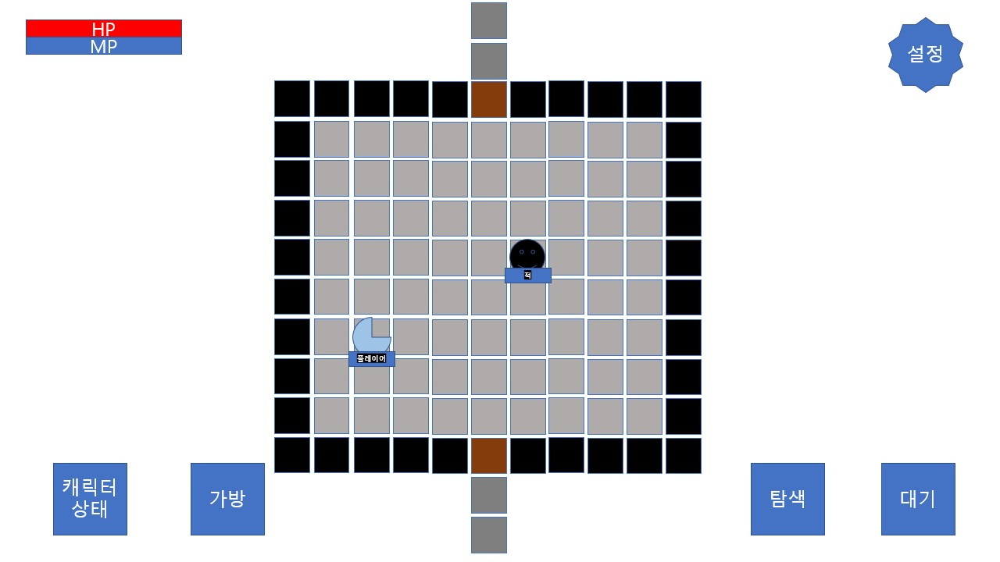
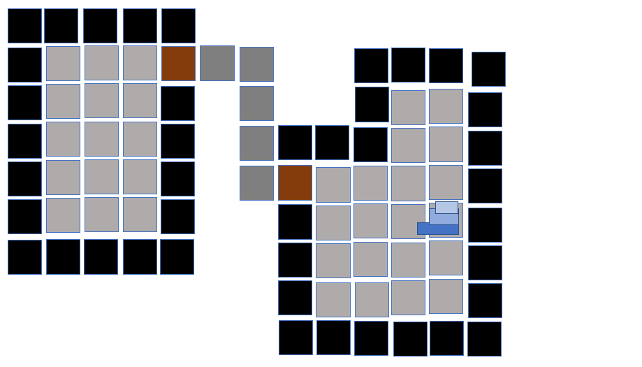

# 프로젝트명: Uncover

# [ 목차 ]
### 1. [컨셉](#num1)
### 2. [관련 이미지 & 동영상](#num2)
### 3. [대표이미지](#num3)
### 4. [구성 요소](#num4)
### 5. [개발 요구사항 및 흐름도](#num5)
### 6. [게임 작업 일정](#num6)
### 7. [주차별 개발 내용](#num7)
### 8. [1주차](#num8)

# [컨셉] <a name = "num1">

## 메인컨셉 : 탐험

- 게임에 대한 기본적인 조작 이외에 목표를 제외한 어느것도 공개하지않아, 매번 플레이어가 직접 알아내며 게임이 진행됨.
- 기본적인 소모품, 장비들도 능력치나 효과가 공개되지않아, 플레이어가 직접 사용하면서 혹은 다른방법으로 효과를 알아내며 게임이 진행됨.

### 서브 컨세 1 : 멀티플렛폼

- 언제 어디든지 유저가 플레이할수있게함.

### 서브 컨세 2 : 단순함

- 복잡하지 않고 단순화된 게임 방식으로 게임을 진행함. 
- 로그라이크 장르 특정상, 많은 버튼들이나 단축키로 이루어진 경우가 많은데 이 버튼들이랑 단축키를 없애 게임을 어렵지 않게 입문하도록함.
### 서브 컨세 3 : 랜덤

- 매번 플레이를 새로 할 때 마다 게임요소가 무작위로 바뀌어서 플레이어가 새롭게 게임을 할수있게함.
### 서브 컨세 4 : 저장

- 게임이 짧고 가볍게 플레이 할 수 있지만, 게임을 중단 할 경우 초기화를 하지 않고, 특정구간 저장기능을 넣어 이어서 플레이 할 수 있게함.  

### 서브 컨세 5 : 타임어택

- 게임에 시간적 제한을 두어, 게임의 전체적인 플레이 시간을 짧게 해, 플레이어가 긴박감을 느낄 수 있게 하고, 짧게 할 수 있으므로, 어디든지 가볍게 플레이 할수 있게함.

  

# [관련 이미지 & 동영상] <a name = "num2">

### [전체적인 게임방식] 던전 크롤 : https://youtu.be/vkzq-W5Fh4o

- 게임 맵, 몬스터, 아이템들이 랜덤 생성되고, 플레이어가 죽으면 초기화되는 방식으로 진행되는 로그라이크게임입니다.

### [가장 영향을 크게 받은 게임] 픽셀던전 : https://youtu.be/5NE9dqKs4rA

- 로그라이크 게임을 터치 하나로만 할 수있게 게임의 조작을 간단하게 만들예정입니다.

### [타임어택 요소] 스펠렁키2 : https://youtu.be/vkzq-W5Fh4o

- 로그라이크 게임의 문제인 긴 플레이타임을 방지하는 시스템입니다.

  

# [대표 이미지]  <a name = "num3">

### [인게임예상도]

- 주요 게임속 상황 사진입니다.

### [인게임예상도.UI]

- UI 예시 사진입니다.

### [게임요소예상도.1]

  
- 한 지역에는 여러개의 방이 있고, 여러개의 방은 통로로 연결되어있습니다.
- 방들은 랜덤으로 생성됩니다.
- 지역들은 계단으로 연결되어있습니다.

### [게임요소예상도.2]

  
- 플레이어는 타일을 클릭해 이동이나 행동 할수 있습니다.
- 적들도 플레이어가 행동한 만큼 행동합니다.
- 서로 접근하여 공격하는 방식으로 전투가 진행됩니다.

### [게임요소예상도.3]

  
- 캐릭터상태 : 캐릭터의 현재 상태를 자세히 알 수 있습니다.
- 가방 : 플레이어가 얻은 물품들을 확인할수 있습니다.
- 탐색 : 숨겨진 타일이나 물건을 찾을 수 있습니다.
- 대기 : 플레이어의 턴을 넘깁니다.
  

# [컨셉 & 대표이미지 기반 작품묘사]

> ### 대표이미지 기반 :

> ### 컨셉 기반: 

  

# [구성 요소] <a name = "num4">

- Uncover
- 비밀로 가득한 던전을 밝히며 탐험하는 로그라이크 게임
  

 

## 1. 메커니즘

[도전 과제]

1. 몬스터들을 잡고 아이템을 획득한다.
2. 아이템들의 숨겨진 속성을 밝혀낸다.
3. 아이템들을 활용해 끝까지 도달해 던전을 공략한다.

[재미 요소]

1. 매번 게임 할때마다 맵과 아이템이 바뀌어 매번 예기치 못한 상황을 만든다.
2. 게임의 큰 틀은 달라지지 않으므로, 게임을 하는 플레이어의 성장을 통해 게임을 진행한다.
3. 매 게임 시작시 아이템을 랜덤으로 제공해, 같은 게임방식의 지루함을 줄인다.

 

## 2. 이야기

**[만들게 된 배경]**

- 랜덤게임을 좋아하는 저로써 가장 랜덤요소가 강한 로그라이크 장르를 선택했습니다.
- 하지만 로그라이크 장르는 긴 플레이시간, 어려운 조작감이 큰 진입장벽인데, 이 둘 요소를 해결하여 로그라이크 장르가 뭔지 쉽게 접근할수 있는 게임을 만들것이라 생각합니다.

**[카메라 관점]**

- 로그라이크 특정상 화면에 간단하면서, 많은 정보를 넣어야 함으로 탑뷰 시점을 선택했습니다.
- 탑뷰 시점에서 게임의 몰입도를 올리기 위해, 플레이어가 특정 상황이 되면 카메라에 색을 추가해 상황을 바로 알수 있습니다.
- 줌인과 줌아웃을 통해 맵 구조를 쉽게 파악 할 수 있습니다.

 

## 3. 미적요소

**[디자인]**

- 게임 배경, 오브젝트로 나뉘어져 있고,배경과 오브젝트들이 구분이 쉽게 만든다.
- 오브젝트들은 아이템, 적, 플레이어로 나뉘어져있고, 적과 플레이어는 짧게나마 애니메이션을 넣어 게임이 진행되는것을 알려준다.
- UI는 왼쪽위에는 간단한 상태를, 아래에는 여러 버튼을 두어 플레이어가 접근 할 수 있게한다.

**[음향]**

- 현재장소가 어디인지 알수있는 느낌의 효과음과 음악을 사용한다.
- 전투시 공격,피격음을 넣는다.
- 체력이 낮아졌을시 심장소리를 넣어 긴박감을 준다.
 

## 4. 기술
- 유니티엔진으로 제작한다.
- 맵생성으로 BSP트리(이진공간분활법)을 사용한다.
- 플레이어와 적 움직임에는 A*를 이용한 길찾기 알고리즘을 이용한다.
  
# [게임오브젝트 분해, 파라미터]
  - https://github.com/WaterGoPotato/WaterGoPotato.github.io/blob/44036e65b11c9564fef68ea6b23ebf0e3f7ccdf3/%EA%B5%AC%EC%84%B1%EC%9A%94%EC%86%8C.md
  
  
  # [개발 요구사항 및 흐름도] <a name = "num5">
  ## 요구사항 [6개월]
* ### 프로그래밍
  * ### 시작화면
    * 기록버튼을 누르면 기록화면으로 이동한다.
    * 새로시작을 누를경우 게임화면으로 이동한다.
  * ### 게임화면
     * 게임의 맵은 랜덤으로 생성되고, 각각 맵에는 전층으로 가는 계단과 다음층으로 가는 계단이 존재한다.
     * 맵이 생성될 때, 오브젝트들이 랜덤 배치된다.
     * 특정 층 도달 시 다음 스테이지로 이동한다.
     * 바닥을 클릭하여 경로확인, 이동을 할 수 있다.
     * 이동중 특정상황을 만나면 이동을 중단한다.
     * 적을 클릭하여 공격할수 있다.
     * 사정거리 밖일 경우 적에게 이동한다.
     * 적들이 죽으면 골드나 아이템을 드랍한다. 경험치를 드랍한다.
     * 아이템을 클릭하여 습득 할 수 있다.
     * 아이템들은 포션, 스크롤, 음식으로 나뉘어져 있으며, 포션과 스크롤의 경우 맨처음 습득히 효과가 공개되지 않는다.
     * 오브젝트를 클릭하여 상호작용 할 수 있다.
     * 플레이어가 최종 스테이지를 클리어시 엔딩화면으로 이동한다.

  ## 요구사항 [6개월]
* ### 그래픽
  * ### 시작화면
    * 시작화면에는 게임 타이틀과 새로시작, 불러오기, 기록, 설정 4개의 버튼이 존재한다.
    * 설정 버튼을 누르면 소리설정, 인게임설정을 할 수 있는 창이 뜬다.
        * 소리설정은 효과음, 배경음악 조절을 할 수 있다.
  * ### 게임화면
    * 게임화면은 양손 드래그로 줌인, 줌아웃 할 수있다.
    * 게임화면 에는 캐릭터이미지, HP바, 로그, 로그창, 인벤토리, 설정 버튼이 존재한다.
    * 캐릭터 이미지를 누르면 캐릭터상태창이 뜨며,= 캐릭터 상태창에는 HP,공격력,방어력,회피율,경험치 스탯이 적혀있다.
    * 인벤토리창은 현재 착용중인 무기, 방어구 상태와 소지하고 있는 아이템, 골드 열쇠보유량이 나온다.
    * 무기, 방어구들은 강화상태와 저주여부, 공격력이나 방어력, 착용가능 능력치가 나온다.
    * 아이템들은 포션, 스크롤, 음식으로 나뉘어져 있으며, 포션과 스크롤의 경우 맨처음 습득히 효과가 공개되지 않는다.
    * 매 플레이마다 포션, 스크롤의 이미지가 바뀐다.
    * 상태이상에 걸렸을 때 시각적 표시가 나타난다.

  ## 요구사항 [12개월]
    * ### 프로그래밍
      * ### 시작화면 
        * 새로시작을 누를경우 게임화면이 나오기전, 첫 게임 스토리가 나온다.
        * 불러오기를 누를경우 최근에 중단했던 게임의 첫구역이 나온다.
      * ### 기록화면
        * 기록화면에는 최대 10개의 플레이 기록이 저장되어있고, 이 기록들을 클릭하면 그 당시 아이템, 스텟, 사인을 알 수 있다.
      * ### 게임화면    
        * 로그창은 최근 20개의 기록이 저장된다.
        * 아이템들은 떨어뜨리거나, 던지거나, 사용할 수 있다.
        * 포션을 던졌을 경우 바닥에 효과가 남고, 마셨을 경우 상태이상이 생긴다.
        * 스크롤을 사용했을 경우 효과가 발동한다.
        * 상자를 클릭해서 상자를 열 수있다. 이 때 상자는 사라지고, 상자가 있던 자리에 아이템이 생성된다.
        * 문은 시야를 막는다. 플레이어가 문을 지나쳐서 이동시 문의 반대편은 보이지않는다.
        * 문을 클릭해서 문을 열 수 있다. 이 때 문은 플레이어가 지나갈때만 열리고 다시 닫힌다.
        * 적들의 경우 여러 상태가 있으며, 상태마다 이동하는 것이 다르다.
        * 적들은 트랩이 공개되어있지 않아도 트랩을 피해간다.
        * 적들은 플레이어가 사정거리 내에 있을 때 공격한다.
        * 적들이 플레이어와 다른 공간에서 스폰된다.
        * HP가 0이 될 경우 플레이어가 사망하고, 사망 시 어떤상황인지 확인 할수있게한다.(아이템 전부공개, 맵 전체공개) 그리고 메인메뉴로 이동한다.
        * 상태이상에 걸릴시 특수 효과가 발동한다.
        * 플레이어의 시야 밖에는 "안개"가 발생하여 시야를 제한한다.

  ## 요구사항 [12개월]
* ### 그래픽
  * ### 시작화면
        * 인게임설정은 게임속도, 타일셋구분을 할 수 있다.
  * ### 기록화면
      * 기록화면에는 최대 10개의 플레이 기록이 저장되어있고, 이 기록들을 클릭하면 그 당시 아이템, 스텟, 사인을 알 수 있다.
  * ### 게임화면
    * 적을 공격하거나, 공격 받았을 때 시각적 표시가 나타난다.
  * ### 엔딩화면
    * 엔딩장면에 다시시작, 기록보기 버튼이 있다.
  # [게임 작업 일정] <a name = "num6">
    * 
  # [주차별 개발 내용] <a name = "num7">
  ## [1주차] <a name = "num8">
    * 
  
  ### 작업명 : 맵 생성

    * 해당 요구사항 : 

    * 게임의 맵은 랜덤으로 생성되고, 각각 맵에는 전 층으로 가는 계단과 다음 층으로 가는 계단이 존재한다. ( 60%)

   ### 구체적 작업 내용 : 
    * 매번 실행 시 마다 다르게 맵을 생성한다. (100%)
    * 맵을 생성할 때 방끼리 복도를 설치한다.(100%) 복도가 끝이 나는 부분은 문으로 설정한다.(50%)
       ###  해결하지 못한 것
       * 문이 만들어 질떄 복도가 겹치는 부분에 생기는 문제점
       * 구석부분에 문이 만들어질떄 문이 튀어나오는 문제점
       * 문들이 계속 연달아 배치되는 문제점
    * 플레이어가 시작하는 방, 플레이어가 도달 해야하는 방 안에 계단을 설치할 지점을 선택한다.(0%)
  
  
    
    
   
    
  
    
