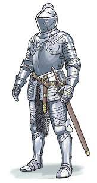
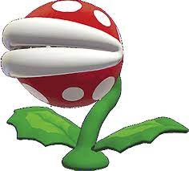
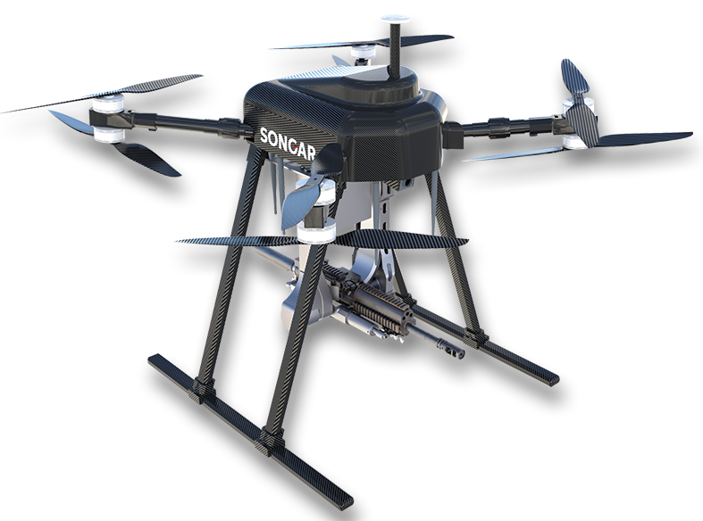
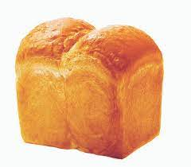
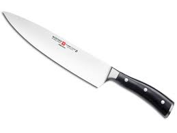
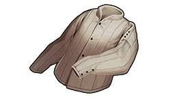
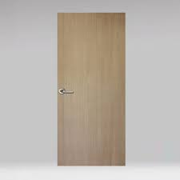
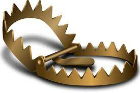

# 게임 오브젝트 분해
## 게임 요소
|종류|오브젝트 이름|오브젝트 이미지(임시)|종류|오브젝트 이름|오브젝트 이미지(임시)|
|:----:|:----:|:----:|:----:|:----:|:----:|
|오브젝트|플레이어||오브젝트|적1||
|오브젝트|적2||오브젝트|적3||
|아이템|음식||오브젝트|적4||
|아이템|포션||아이템|스펠북||
|아이템|열쇠||장비|무기||
|장비|방어구||지형|바닥||
|지형|벽||오브젝트|문||
|오브젝트|상자||오브젝트|트랩||
|지형|안개||

<!--
## UI
|종류|UI 이름|UI 이미지|비고|종류|UI 이름|UI 이미지|비고|
|:----:|:----:|:----:|:----:|:----:|:----:|:----:|:----:|
|메인메뉴|게임시작|:----:||메인메뉴|설정|:----:||
|다용도|다이얼|:----:||다용도|게임시작|:----:|
|설정|게임시작|:----:||
|메인메뉴|게임시작|:----:||
-->
# 파라미터 뽑아보기

## [플레이어] 
|한문|영문|설명|
|:----:|:----:|:----:|
|체력|statHp|플레이어의 체력, HP < 0일경우 게임오버, MaxHp >= Hp|
|최대체력|statMaxHp|플레이어가 가질 수 있는 체력최대치|
|공격력|statAttack|적에게 주는 피해량의 기준|
|방어력|statDefence|적에게 받는 피해량의 경감 기준|
|회피율|statDodge|적에게 받는 피해량을 피하는 기준|
|명중률|stataccuracy|적에게 주는 피해량을 맞추는 기준 |
|이동속도|statMoveSpeed|턴당 이동하는 량|
|이동량|statMoveStack|이동속도가 소수점일때 턴이 지난 후 소수점을 저장하는 공간, 정수가 될시 그만큼 추가턴|
|공격속도|statAttackSpeed|턴당 공격하는 량|
|공격량|statAttackStack|공격속도가 소수점일때 턴이 지난 후 소수점을 저장하는 공간, 정수가 될시 그만큼 추가턴|
|골드|playerHaveGold|골드|
|열쇠|playerHaveKey|열쇠|
|진행층수|nowStair|현재 몇층인지 저장|
|상태이상|arr_State|배열, 상태이상이 걸렷을시 true, 아닐시 false   [화상][마비][공중][사망]순|
|상태이상턴|stateduration|상태이상이 남은 턴 수|
|배고픔수치|statCalorie|배고픔수치, 0일시 매턴 피해를입음|
|경험치|statNowExp|현재 가지고있는 경험치, 최대경험치보다 높아질시 추가 스탯증정, 최대경험치 증가|
|최대경험치|statMaxExp|최대로 얻을수 있는 경험치, 경험치가 최대 경험치량이 될떄마다 증가.|
|시야|statVisualRange|보이는 시야의 칸, 이 이후의 칸들은 안개가 껴서 관측이 불가|

## [적]
|한문|영문|설명|
|:----:|:----:|:----:|
|체력|statHp|체력. 0이 될시 게임오버 최대|
|최대체력|statMaxHp|이 체력 이상으로 체력이 올라가지 않음.|
|공격력|statAttack|적에게 주는 피해량의 기준|
|방어력|statDefence|적에게 받는 피해량의 경감 기준|
|회피율|statDodge|적에게 받는 피해량을 피하는 기준|
|명중률|stataccuracy|적에게 주는 피해량을 맞추는 기준 |
|이동속도|statMoveSpeed|턴당 이동하는 량|
|이동량|statMoveStack|이동속도가 소수점일때 턴이 지난 후 소수점을 저장하는 공간, 정수가 될시 그만큼 추가턴|
|공격속도|statAttackSpeed|턴당 공격하는 량|
|공격량|statAttackStack|공격속도가 소수점일때 턴이 지난 후 소수점을 저장하는 공간, 정수가 될시 그만큼 추가턴|
|골드|playerHaveGold|골드, 플레이어와는 다르게 주는 골드의 량|
|상태이상|arrState|배열, 상태이상이 걸렷을시 true, 아닐시 false   [화상][마비][공중][사망]순|
|상태이상턴|stateduration|상태이상이 남은 턴 수|
|경험치|statNowExp|주는 경험치의 량|
|시야|statVisualRange|적의 인식 범위|
|아이템드롭률|itemDropProbability|아이템이 떨어질 확률.|
|최대아이템드롭갯수|g_arr_itemDropQuantity|드랍될 총 아이템 횟수배열, 이 이상 아이템이 나오지 않음 |
|드롭될 아이템의 종류|arr_ItemDropKind|아이템들이 담겨있는 배열. true 시 그 아이템이 나옴|
|적의 종류|enemyKind|적의 종류. 1.일반, 2.고정형, 3.공중, 4.원거리|
|경험치|statNowExp|주는 경험치의 량|
|적의 사정거리|statEnemyRange|적의 공격사정거리|
|행동 상태|enemyMoveState|적의 움직이는 상태, 1.수면 2.일반 3.추적 4.탐색|

## [음식]
|한문|영문|설명|
|:----:|:----:|:----:|
|음식의 열량|foodCalorie|배고픔수치를 채워주는정도|
|재질의 종류|itemKind|아이템의 종류(음식,포션,스펠북 구분용도)|

## [포션]
|한문|영문|설명|
|:----:|:----:|:----:|
|포션의 종류|itemNum|여러개의 포션중 어떤 포션인지. 정수형 1~X개|
|포션의 비밀공개여부|IsUncover|포션이 정확하게 어떤포션인지 표기여부. false시 가려짐|
|재질의 종류|itemKind|아이템의 종류(음식,포션,스펠북 구분용도)|

## [스펠북]
|한문|영문|설명|
|:----:|:----:|:----:|
|스펠북의 종류|itemNum|여러개의 스펠북중 어떤 스펠북인지. 정수형 1~X개|
|스펠북의 비밀공개여부|IsUncover|스펠북이 정확하게 어떤스펠북인지 표기여부. false시 가려짐|
|재질의 종류|itemKind|아이템의 종류(음식,포션,스펠북 구분용도)|

## [열쇠]
|한문|영문|설명|
|:----:|:----:|:----:|

## [무기]
|한문|영문|설명|
|:----:|:----:|:----:|
|무기의 등급|equipRating|무기의 등급, 기본수치가 증가됨 |
|무기의 강화정도|equipEnhanace|무기의 강화된 정도. 기본수치 * 1.강화정도|
|무기의 공격력|equipStat|공격력|
|무기의 공격속도|equipWeaopnAttackSpeed|무기의 공격속도.(기본값1)|
|무기의 요구능력치|equipRequire|특정 레벨이하시 공격력 = 공격력 * (1-0.부족한만큼)|
|무기의 종류|equipKind|무기,방어구 구분용도|
|무기의 이미지|equipImage|무기의 이미지, 1~x개|

## [방어구]
|한문|영문|설명|
|:----:|:----:|:----:|
|방어구의 등급|equipRating|방어구의 등급, 기본수치가 증가됨 |
|방어구의 강화정도|equipEnhanace|방어구의 강화된 정도. 기본수치 * 1.강화정도|
|방어구의 방어력|equipStat|방어력, 일정 공격력을 막아줌.|
|방어구의 요구능력치|equipRequire|특정 레벨이하시 방어력 = 방어력 * (1-0.부족한만큼)|
|방어구의 종류|equipKind|무기,방어구 구분용도|
|방어구의 이미지|equipImage|방어구의 이미지, 1~x개|

## [바닥]
|한문|영문|설명|
|:----:|:----:|:----:|
|바닥의 종류|tileKind|바닥의 종류, 1.일반 2.풀 3.물 4.불탄풀.5.빈공간|
|바닥의 가림막여부|tileHasBlind|이 타일이 시야를 막는지 false 시 막지않음|

## [문]
|한문|영문|설명|
|:----:|:----:|:----:|
|문의 종류|doorKind|문의 종류|
|문의 개방여부|IsOpen|ture시 문이 열려있는상태.|

## [벽]
|한문|영문|설명|
|:----:|:----:|:----:|
|벽의 종류|wallKind|벽의 종류|

## [상자]
|한문|영문|설명|
|:----:|:----:|:----:|
|상자의 종류|boxKind|상자의 종류|
|상자의 개방여부|IsDoon|이미 상자를 활성화 했는지|
|상자의 열쇠필요여부|IsHaveKey|열쇠필요한지 여부 true시 열쇠가 필요함, 열쇠 사용시 false로 변환|
|상자속 아이템|boxHaveItem|int형, 상자를 활성화시 이 아이템을 떨어뜨리고 상자가 사라짐.|

## [트랩]
|한문|영문|설명|
|:----:|:----:|:----:|
|트랩의 종류|trapKind|트랩의 종류|
|트랩의 개방여부|trapIsUncover|true 시 일반 바닥으로 보임, false시 트랩으로 보임|
|트랩의 활성화 여부|IsDoon|트랩이 활성화 되었을대 true로 변환하고 사라짐|
|트랩의 대미지|trapDamage|트랩을 밣을경우 대미지, 방어력에 막힘|

## [안개]
|한문|영문|설명|
|:----:|:----:|:----:|
|안개의 개방여부|IsUncover|true시 까만 안개효과를 냄|

# 행동

## [플레이어]
|행동|설명|
|:----:|:----:|
|이동|플레이어가 클릭한 위치로 길찾기 이동|
|공격|접촉한 몹 클릭 시 공격|
|소모형 아이템 사용|포션, 음식, 스펠북 사용|
|소모형 아이템 던지기|특정 아이템을 지정 위치에서 상호작용|
|무기,방어구 착용|길찾기 이동|
|오브젝트 상호작용|상자, 문 같은 겹치지 않는 오브젝트와 상호작용|
|오브젝트 상호작용|드랍된 아이템 같은 겹치는 오브젝트와 상호작용|
|대기|대기중일때 일정 시간마다 이미지변경|

## [적1]
|행동|설명|
|:----:|:----:|
|이동|목표물로 길찾기 이동|
|공격|접촉한 플레이어 공격|
|대기|대기중일때 일정 시간마다 이미지변경|

## [적2]
|행동|설명|
|:----:|:----:|
|공격|접촉한 플레이어 공격|
|원거리 공격|사정거리 내 플레이어 공격|
|대기|대기중일때 일정 시간마다 이미지변경|

## [적3]
|행동|설명|
|:----:|:----:|
|이동|목표물로 길찾기 이동|
|공격|접촉한 플레이어 공격|
|대기|대기중일때 일정 시간마다 이미지변경|

## [적4]
|행동|설명|
|:----:|:----:|
|이동|목표물과의 거리가 0 ~ statEnemyRange일 경우 목표물과 멀어지는, 아닐경우 목표물로 길찾기 이동|
|원거리 공격|사정거리 내 플레이어 공격|
|대기|대기중일때 일정 시간마다 이미지변경|

# 상태 -- 다시

## [플레이어]
|현상태|전이상태|설명|
|:----:|:----:|:----:|
|정상|기본|기본 상태|
|부상|정상->부상|statHP < statMaxHp * 0.3, HP가 30% 이하일경우|
|배고픔|정상->배고픔|statCalorie < 0.3, 배고픔이 30% 이하일경우|
|굶주림|배고픔->굶주림|statCalorie <= 0, 배고픔이 0% 일경우.|
||||
|불붙음|정상->불붙음|arr_State[0] = true,불이 붙은상태. 지속적으로 대미지를 입음|
|마비|정상->마비|arr_State[1] = true,아무행동도 불가능한 상태|
|사망|부상->사망|statHP <= 0, HP가 0일경우|

## [적]
|상태|전이상태|설명|
|:----:|:----:|:----:|
|수면|기본|기본 상태, 아무 행동도 취하지않음|
|추적|기본->추적,탐색->추적|플레이어를 쫒아가는 상태, 플레이어와의 거리 < statVisualRange(적의 시야거리)|
|탐색|추적->탐색|플레이어를 찾는 상태, enemyMoveState(적의 행동상태)  != 0, 플레이어와의 거리 > statVisualRange(적의 시야거리)|
|공격|추적->공격|statEnemyRange(적의 시야거리) > 플레이어와의 거리|
||||
|불붙음|수면->불붙음,추적->불붙음,탐색->불붙음|플레이어와 동일|
|마비|수면->마비,추적->마비,탐색->마비|플레이어와 동일|
|사망|수면->사망,추적->사망,탐색->사망|statHP < 0, HP가 0일경우|

## 문
|상태|전이상태|설명|
|:----:|:----:|:----:|
|닫힘|기본상태|IsOpen == true|
|열림|닫힘->열림|IsOpen == false, 이상태가 되면 오브젝트가 소멸|

## 트랩
|상태|전이상태|설명|
|:----:|:----:|:----:|
|숨겨짐|기본상태|기본상태, trapIsUncover == false|
|밝혀짐|숨겨짐->밝혀짐| trapIsUncover == true|
|발동됨|닫힘->열림|열려있는상태, 이상태가 되면 오브젝트가 소멸|
|발동됨|닫힘->열림|열려있는상태, 이상태가 되면 오브젝트가 소멸|
# 게임의 규칙 --다시

## 게임의 목표
1. 특정 층 수 까지 살아서 이동한다.

## 규칙, 공식
1. 마우스 클릭으로 모든 조작을 할 수 있다.
2. 바닥을 클릭 시 그 위치로 이동한다.
3. 이동 중 모래시계를 클릭 시 진행중인 모든 행동이 중지된다.

### 기본규칙, 공식

# 게임에서 사용될 요소규칙, 공식  --다시
## 기본
1. 모든 턴은 플레이어 -> 적 -> 월드효과 순으로 이어진다.
2. 모든 행동의 기본 단위는 "1턴"이다.
3. "1칸" 이동시 기본적으로 "1턴" 소모한다.
4. 공격시 기본적으로 "1턴" 소모한다.

## 공격시
1. 공격시 공격적중률은 = 1 - (공격받는 대상의 회피율 - 공격하는 대상의 명중률 + 0.2) 이고, 만약 공격 적중률이  랜덤수(0~1) 이하일 경우 공격이 적중한다.
2. 공격하는 대상의 공격력 - 공격받는 대상의 방어력으로 피해를 입힌다. 
3. 공격속도가 1.0 이상일경우, 남은 공격량에 소숫점을 넣고, 소숫점이 1 이상일 경우 턴이 지나가지 않는다.
4. statHp < 0이 될시, 플레이어는 게임종료페이지로 가고, 적은 소멸한다.

## 이동시
1. 기본 이동속도는 1.0 이고, 1턴에 1칸을 움직일 수 있다.
2. 이동속도가 1.0 이상일경우, 남은 이동량에 소숫점을 넣고, 소숫점이 1 이상일 경우 턴이 지나가지 않는다.

## 배고픔
1. 배고픔은 1이 최대량이고, 매턴 0.01씩 소모한다.
2. 음식을 사용시 배고픔을 0.3씩 올려준다.
3. 배고픔이 0.4 이하일 시 배고픔 상태가 된다.
4. 배고픔이 0 이하일 시 굶주린 상태가 되고, 피해를 최대체력 * 0.03씩 매턴 입는다.

## 아이템 사용시
1. 음식아이템은 사용시 5턴을 소모한다.
2. 배고픔 상태를 위한 음식 소모시, 배고픔상태가 잠시 정지된다.
3. 나머지아이템은 사용시 1턴을 소모한다.
4. 포션을 던지거나, 스크롤로 월드효과 발동시, 10턴동안 유지된다.

## 상태이상
### 화상
1. 화상은 stateduration이 0일 경우 종료된다.(정상상태로 변화)
2. 화상은 바닥이 물 타일일 경우 stateduration이 0이된다.
3. 화상상태때는 매턴 피해를 최대체력 * 0.05씩 매턴 입는다.

### 마비
1. 마비는 stateduration이 0일 경우 종료된다.(정상상태로 변화)
2. 마비상태때는  매턴 공격속도, 이동속도가 0이된다.

## 트랩
1. 트랩을 발동시, 가장 가까운 적, 플레이어를 대상으로 하며, 최대체력 * 0.2의 피해를 입힌다.
2. 트랩은 발동이후 소멸한다.

