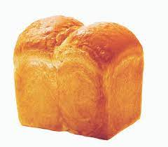
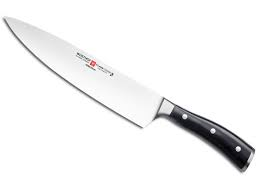
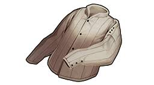
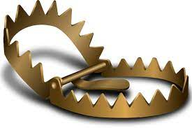

1. 게임 오브젝트 분해

|연번|오브젝트 이름|오브젝트 이미지|
|:----:|:----:|:----:|
|1|플레이어||
|2|적||
|3|음식||
|4|포션||
|5|스펠북||
|6|열쇠||
|7|무기||
|8|방어구||
|9|바닥||
|10|벽||
|11|문||
|12|상자||
|13|트랩||
|14|안개||

2. 파라미터 뽑아보기

[플레이어]
|한문|영문|설명|
|:----:|:----:|:----:|
|체력|statHp|체력. 0이 될시 게임오버 최대|
|최대체력|statMaxHp|이 체력 이상으로 체력이 올라가지 않음.|
|공격력|statAttack|적에게 주는 피해량의 기준|
|방어력|statDefence|적에게 받는 피해량의 경감 기준|
|회피률|statDodge|적에게 받는 피해량을 피하는 기준|
|명중율|stataccuracy|적에게 주는 피해량을 맞추는 기준 |
|이동속도|statMoveSpeed|턴당 이동하는 량|
|이동량|statMoveStack|이동속도가 소수점일때 턴이 지난 후 소수점을 저장하는 공간, 정수가 될시 그만큼 추가턴|
|공격속도|statAttackSpeed|턴당 공격하는 량|
|공격량|statAttackStack|공격속도가 소수점일때 턴이 지난 후 소수점을 저장하는 공간, 정수가 될시 그만큼 추가턴|
|골드|playerHaveGold|골드|
|진행층수|nowStair|현재 몇층인지 저장|
|상태이상|arr_State|배열, 상태이상이 걸렷을시 true, 아닐시 false   [화상][마비][공중][사망]순|
|배고픔수치|statCalorie|배고픔수치, 0일시 매턴 피해를입음|
|경험치|statNowExp|현재 가지고있는 경험치, 최대경험치보다 높아질시 추가 스탯증정, 최대경험치 증가|
|최대경험치|statMaxExp|최대로 얻을수 있는 경험치, 경험치가 최대 경험치량이 될떄마다 증가.|
|시야|statVisualRange|보이는 시야의 칸, 이 이후의 칸들은 안개가 껴서 관측이 불가|

[적]
|한문|영문|설명|
|:----:|:----:|:----:|
|체력|statHp|체력. 0이 될시 게임오버 최대|
|최대체력|statMaxHp|이 체력 이상으로 체력이 올라가지 않음.|
|공격력|statAttack|적에게 주는 피해량의 기준|
|방어력|statDefence|적에게 받는 피해량의 경감 기준|
|회피률|statDodge|적에게 받는 피해량을 피하는 기준|
|명중율|stataccuracy|적에게 주는 피해량을 맞추는 기준 |
|이동속도|statMoveSpeed|턴당 이동하는 량|
|이동량|statMoveStack|이동속도가 소수점일때 턴이 지난 후 소수점을 저장하는 공간, 정수가 될시 그만큼 추가턴|
|공격속도|statAttackSpeed|턴당 공격하는 량|
|공격량|statAttackStack|공격속도가 소수점일때 턴이 지난 후 소수점을 저장하는 공간, 정수가 될시 그만큼 추가턴|
|골드|playerHaveGold|골드, 플레이어와는 다르게 주는 골드의 량|
|상태이상|arrState|배열, 상태이상이 걸렷을시 true, 아닐시 false   [화상][마비][공중][사망]순|
|경험치|statNowExp|주는 경험치의 량|
|시야|statVisualRange|적의 인식 범위|
|아이템드롭률|itemDropProbability|아이템이 떨어질 확률.|
|최대아이템드롭갯수|g_arr_itemDropQuantity|드랍될 총 아이템 횟수배열, 이 이상 아이템이 나오지 않음 |
|드롭될 아이템의 종류|arr_ItemDropKind|아이템들이 담겨있는 배열. true 시 그 아이템이 나옴|
|적의 종류|enemyKind|적의 종류. 1.일반, 2.고정형, 3.공중, 4.원거리|
|경험치|statNowExp|주는 경험치의 량|
|적의 사정거리|statEnemyRange|적의 공격사정거리|

[음식]
|한문|영문|설명|
|:----:|:----:|:----:|
|음식의 열량|foodCalorie|배고픔수치를 채워주는정도|
|재질의 종류|itemKind|아이템의 종류(음식,포션,스펠북 구분용도)|

[포션]
|한문|영문|설명|
|:----:|:----:|:----:|
|포션의 종류|itemNum|여러개의 포션중 어떤 포션인지. 정수형 1~X개|
|포션의 비밀공개여부|IsUncover|포션이 정확하게 어떤포션인지 표기여부. false시 가려짐|
|재질의 종류|itemKind|아이템의 종류(음식,포션,스펠북 구분용도)|

[스펠북]
|한문|영문|설명|
|:----:|:----:|:----:|
|스펠북의 종류|itemNum|여러개의 스펠북중 어떤 스펠북인지. 정수형 1~X개|
|스펠북의 비밀공개여부|IsUncover|스펠북이 정확하게 어떤스펠북인지 표기여부. false시 가려짐|
|재질의 종류|itemKind|아이템의 종류(음식,포션,스펠북 구분용도)|

[열쇠]
|한문|영문|설명|
|:----:|:----:|:----:|
|열쇠의 종류|keyKind|상자, 문열쇠 구분용도|

[무기]
|한문|영문|설명|
|:----:|:----:|:----:|
|무기의 등급|equipRating|무기의 등급, 기본수치가 증가됨 |
|무기의 강화정도|equipEnhanace|무기의 강화된 정도. 기본수치 * 1.강화정도|
|무기의 공격력|equipStat|공격력|
|무기의 공격속도|equipWeaopnAttackSpeed|무기의 공격속도.(기본값1)|
|무기의 요구능력치|equipRequire|특정 레벨이하시 공격력 = 공격력 * (1-0.부족한만큼)|
|무기의 종류|equipKind|무기,방어구 구분용도|
|무기의 이미지|equipImage|무기의 이미지, 1~x개|

[방어구]
|한문|영문|설명|
|:----:|:----:|:----:|
|방어구의 등급|equipRating|방어구의 등급, 기본수치가 증가됨 |
|방어구의 강화정도|equipEnhanace|방어구의 강화된 정도. 기본수치 * 1.강화정도|
|방어구의 방어력|equipStat|방어력, 일정 공격력을 막아줌.|
|방어구의 요구능력치|equipRequire|특정 레벨이하시 방어력 = 방어력 * (1-0.부족한만큼)|
|방어구의 종류|equipKind|무기,방어구 구분용도|
|방어구의 이미지|equipImage|방어구의 이미지, 1~x개|

[바닥]
|한문|영문|설명|
|:----:|:----:|:----:|
|바닥의 종류|tileKind|바닥의 종류, 1.일반 2.풀 3.물 4.불탄풀.5.빈공간|
|바닥의 가림막여부|tileHasBlind|이 타일이 시야를 막는지 false 시 막지않음|

[문]
|한문|영문|설명|
|:----:|:----:|:----:|
|문의 종류|doorKind|문의 종류|
|문의 개방여부|IsOpen|ture시 문이 열려있는상태.|

[벽]
|한문|영문|설명|
|:----:|:----:|:----:|
|벽의 종류|wallKind|벽의 종류|

[상자]
|한문|영문|설명|
|:----:|:----:|:----:|
|상자의 종류|boxKind|상자의 종류|
|상자의 개방여부|IsDoon|이미 상자를 활성화 했는지|
|상자의 열쇠필요여부|IsHaveKey|열쇠필요한지 여부 true시 열쇠가 필요함, 열쇠 사용시 false로 변환|
|상자속 아이템|boxHaveItem|int형, 상자를 활성화시 이 아이템을 떨어뜨리고 상자가 사라짐.|

[트랩]
|한문|영문|설명|
|:----:|:----:|:----:|
|트랩의 종류|trapKind|트랩의 종류|
|트랩의 개방여부|trapIsUncover|true 시 일반 바닥으로 보임, false시 트랩으로 보임|
|트랩의 활성화 여부|IsDoon|트랩이 활성화 되었을대 true로 변환하고 사라짐|
|트랩의 대미지|trapDamage|트랩을 밣을경우 대미지, 방어력에 막힘|

[안개]
|한문|영문|설명|
|:----:|:----:|:----:|
|안개의 개방여부|IsUncover|true시 까만 안개효과를 냄|

3. 행동
[플레이어]
|행동|설명|
|:----:|:----:|
|이동|플레이어가 클릭한 위치로 길찾기 이동|
|공격|접촉한 몹 클릭 시 공격|
|소모형 아이템 사용|포션, 음식, 스펠북 사용|
|무기,방어구 착용|길찾기 이동|
|오브젝트 상호작용|상자, 문 같은 겹치지 않는 오브젝트와 상호작용|
|오브젝트 상호작용|드랍된 아이템 같은 겹치는 오브젝트와 상호작용|
|대기|대기중일때 일정 시간마다 이미지변경|

[적]
|한문|영문|설명|
|:----:|:----:|:----:|
|이동|목표물로 길찾기 이동|
|공격|접촉한 플레이어 공격|
|대기|대기중일때 일정 시간마다 이미지변경|

4. 상태
[플레이어]
|현상태|설명|
|:----:|:----:|
|정상|일반상태|
|부상|HP시 일정이하|
|배고픔|배고픔수치 일정이하|
|굶주림|배고픔수치 0이하|
|화상(불)|불이 붙은 상태, 매턴 대미지, 풀바닥에 전이됨|
|마비|아무행동도 불가능한 상태.|
|사망|HP가 0일 때|

정상->부상->사망
정상->배고픔->굶주림
정상->화상
정상->마비

[적]
|상태|설명|
|:----:|:----:|
|대기|아무행동도 하지않음|
|추적|플레이어를 쫒아가는 상태|
|탐색|플레이어를 찾는 상태|
|공격|플레이어를 공격하는 상태|
|화상(불)|불이 붙은 상태, 매턴 대미지, 풀바닥에 전이됨|
|마비|아무행동도 불가능한 상태.|
|사망|HP가 0일 때|

수면->탐색->추적->공격
화상, 마비, 사망은 플레이어와 같음.

6.게임의 규칙

1) 핵심 규칙

3) 보조 규칙
